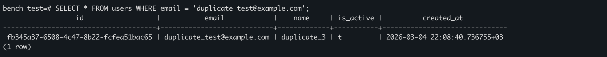
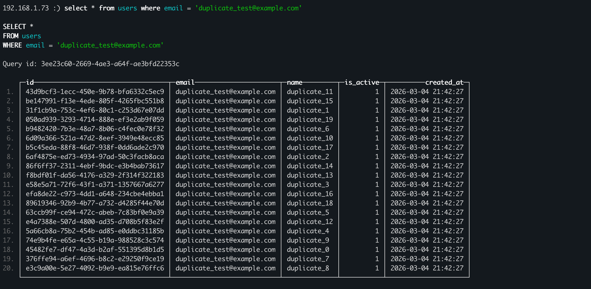
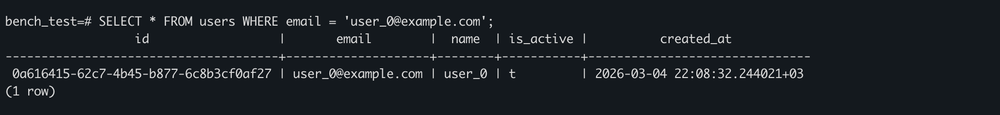
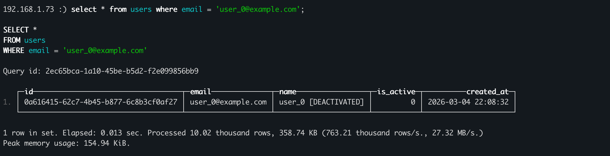

# ClickHouse vs PostgreSQL Benchmark

A Go benchmark suite that compares ClickHouse (OLAP) and PostgreSQL (OLTP) across real-world database operations. Demonstrates why each database excels at different workloads and why using both is the right architectural decision.

## Results Summary

| Benchmark                         | PostgreSQL              | ClickHouse              | Winner               |
| --------------------------------- | ----------------------- | ----------------------- | -------------------- |
| Point Lookup (5K queries)         | 40µs/query              | 970µs/query             | **PG ~24x faster**   |
| Single-Row UPDATE (250)           | 151µs/update            | 3.9ms/update            | **PG ~26x faster**   |
| UNIQUE Constraint (20 concurrent) | 1 accepted, 19 rejected | 20 accepted, 0 rejected | **PG (correct)**     |
| Transaction Atomicity             | Rolled back cleanly     | Partially corrupted     | **PG (correct)**     |
| Partial JSON Update (1250)        | ~116µs/update           | ~8.7ms/update           | **PG ~75x faster**   |
| Bulk Insert (1M rows)             | 98K rows/sec            | 2.7M rows/sec           | **CH ~28x faster**   |
| Aggregation (1M rows)             | 47-130ms                | 10-21ms                 | **CH 5-12x faster**  |

> Tested on Apple M2, PostgreSQL 15.13, ClickHouse 25.11.2, 10K users + 10K user_filters + 1M trades.

---

## Benchmarks

### 1. Point Lookup by Primary Key

**Tests:** `SELECT * FROM users WHERE id = ?` — the query every authenticated API request makes.

PostgreSQL uses a B-tree index that finds any row in 2-4 page reads. ClickHouse uses a sparse index that marks every 8,192nd row, so a single-row lookup must scan an entire granule.

```
--- Run #1 (200 queries) ---
PostgreSQL:  13.8ms total   (avg 69µs/query)
ClickHouse:  227.8ms total  (avg 1.1ms/query)

--- Run #2 (1000 queries) ---
PostgreSQL:  51.2ms total   (avg 51µs/query)
ClickHouse:  997.2ms total  (avg 997µs/query)

--- Run #3 (5000 queries) ---
PostgreSQL:  201.6ms total  (avg 40µs/query)
ClickHouse:  4.85s total    (avg 970µs/query)
```

PG gets faster with more queries (connection pool warm-up). CH stays flat ~1ms because every query scans a full granule regardless.

### 2. Single-Row UPDATE

**Tests:** `UPDATE users SET is_active = ? WHERE id = ?` — toggling a user preference or deactivating an account.

PostgreSQL modifies the row in-place via B-tree index — sub-millisecond, immediately visible. ClickHouse runs `ALTER TABLE UPDATE` which creates a background mutation job that rewrites the entire data part containing that row.

```
--- Run #1 (10 updates) ---
PostgreSQL:  6ms total    (avg 602µs/update)
ClickHouse:  44.9ms total (avg 4.5ms/update)

--- Run #2 (50 updates) ---
PostgreSQL:  11.6ms total   (avg 232µs/update)
ClickHouse:  199ms total    (avg 3.9ms/update)

--- Run #3 (250 updates) ---
PostgreSQL:  37.7ms total   (avg 151µs/update)
ClickHouse:  986.7ms total  (avg 3.9ms/update)
```

ClickHouse requires `SETTINGS mutations_sync = 1` to wait for completion — without it, the old value is still returned by queries after the update.

### 3. UNIQUE Constraint Enforcement

**Tests:** 20 goroutines concurrently insert the same email address.

This is a correctness test, not a performance test. PostgreSQL rejects duplicates at the engine level. ClickHouse has no constraints — all inserts succeed silently.

```
PostgreSQL: Success: 1, Rejected: 19  (UNIQUE enforced)
ClickHouse: Success: 20, Rejected: 0  (all duplicates stored)

ClickHouse rows with email 'duplicate_test@example.com': 20
```

**PostgreSQL** — 1 row accepted, 19 rejected:



**ClickHouse** — 20 duplicates stored:



#### Why Application-Level Workarounds Don't Fix This

What if check the email exists before inserting. I tested this — SELECT before INSERT with 20 concurrent goroutines:

```
ClickHouse (check-before-insert): Inserted: 20, Skipped: 0, Failed: 0
ClickHouse rows with email: 20 (duplicates despite check-before-insert!)
```

All 20 goroutines read `count = 0` before any insert became visible, then all 20 inserted. This is a classic **TOCTOU (Time-of-Check-Time-of-Use)** race condition. Here's why every application-level approach fails:

| Approach | Why It Fails |
| --- | --- |
| **SELECT then INSERT** | TOCTOU race — multiple readers see "not found" before any write lands. ClickHouse has no row locks to serialize this window. |
| **Application mutex** | Only protects a single process. In production with multiple app instances behind a load balancer, each instance has its own mutex — the race condition returns between processes. |
| **Distributed lock (Redis/etcd)** | Technically works, but adds a network round-trip and a single point of failure to every insert. You're building a constraint engine outside the database — fragile, slow, and defeats ClickHouse's throughput advantage. |
| **ReplacingMergeTree engine** | Deduplicates rows with the same `ORDER BY` key, but only during **background merges** which happen asynchronously. Duplicates exist between merges and queries return them unless you use `SELECT ... FINAL` (which forces a merge at read time and is significantly slower). This is eventual cleanup, not a constraint. |
| **INSERT ... IF NOT EXISTS** | Does not exist in ClickHouse. There is no conditional insert syntax. |
| **ON CONFLICT / ON DUPLICATE KEY** | Does not exist in ClickHouse. These are OLTP constructs that require unique index lookups at write time — the opposite of ClickHouse's append-only design. |

#### Why PostgreSQL Gets This Right

PostgreSQL enforces `UNIQUE` at the **storage engine level**. When two transactions try to insert the same email concurrently, the second one blocks on the index lock until the first commits, then receives a constraint violation error. This guarantee holds regardless of:

- How many application instances are running
- How many concurrent requests arrive
- Whether the application has any awareness of duplicates at all

This is the fundamental difference: **PostgreSQL treats uniqueness as a database guarantee, ClickHouse treats it as an application problem.** For data where duplicates mean broken authentication, double charges, or corrupted user profiles — you need the guarantee, not a best-effort workaround.

### 4. Transaction Atomicity

**Tests:** A 3-step "deactivate user" operation where step 3 fails — simulating a real-world multi-step flow like login (verify password → delete old tokens → issue new token).

PostgreSQL wraps all steps in `BEGIN`/`COMMIT`. If any step fails, `ROLLBACK` undoes everything — the user is unchanged. ClickHouse has no transactions. Each mutation is independent and permanently committed. If step 3 fails, steps 1 and 2 cannot be undone.

```
PostgreSQL — 3-step transaction with ROLLBACK:
  Before: name="user_0", is_active=true
  Step 1 (set is_active=false): OK
  Step 2 (append [DEACTIVATED] to name): OK
  Step 3 (set email=NULL): FAILED — violates not-null constraint
  ROLLBACK executed — all changes undone
  After:  name="user_0", is_active=true
  Result: User is UNCHANGED

ClickHouse — 3-step operation with NO rollback:
  Before: name="user_0", is_active=true
  Step 1 (set is_active=0): OK — permanently committed
  Step 2 (append [DEACTIVATED] to name): OK — permanently committed
  Step 3: FAILED
  NO ROLLBACK available — steps 1 and 2 cannot be undone
  After:  name="user_0 [DEACTIVATED]", is_active=0
  Result: User is CORRUPTED
```

This is the most dangerous failure mode for application data. A failed login attempt, interrupted password reset, or crashed deactivation flow leaves the database in an inconsistent state with no recovery path.

**PostgreSQL** — rolled back, user unchanged:



**ClickHouse** — partially corrupted, no undo:



### 5. Partial JSON Update

**Tests:** Partial modification of a JSONB filter document — changing a single key, updating a nested path, and appending to an array. Simulates updating user preferences, saved search filters, or notification settings.

PostgreSQL uses `jsonb_set()` to surgically modify one key inside the document in a single atomic SQL statement — the rest of the document is untouched. ClickHouse has no server-side JSON mutation function, so the application must: read the full document, deserialize in Go, modify, re-serialize, then write back the entire string via `ALTER TABLE UPDATE`.

```
--- Run #1 (50 updates) ---
                          PostgreSQL        ClickHouse
Scalar (sort_by):         182µs/update      9.3ms/update
Nested (price_range.max): 129µs/update      8.6ms/update
Array append (brands):    136µs/update      8.6ms/update

--- Run #2 (250 updates) ---
                          PostgreSQL        ClickHouse
Scalar (sort_by):         159µs/update      8.6ms/update
Nested (price_range.max): 106µs/update      8.5ms/update
Array append (brands):    100µs/update      8.7ms/update

--- Run #3 (1250 updates) ---
                          PostgreSQL        ClickHouse
Scalar (sort_by):         121µs/update      8.5ms/update
Nested (price_range.max): 114µs/update      8.7ms/update
Array append (brands):    113µs/update      8.8ms/update
```

All three scenarios perform nearly identically within each database. For PG, the cost is the B-tree lookup + WAL write — `jsonb_set()` path depth doesn't matter at this document size. For CH, the bottleneck is the mutation mechanism (rewriting the entire data part), not the JSON operation itself.

### 6. Bulk Insert Throughput (CH wins)

**Tests:** Batch insert of market trade data (symbol, price, volume, timestamp) — simulating exchange data ingestion.

ClickHouse writes each batch as an immutable data part with no index updates or constraint checks. PostgreSQL must maintain B-tree indexes, enforce constraints, and write WAL entries for every row.

```
--- 100K rows ---
PostgreSQL:  845ms    (118K rows/sec)
ClickHouse:  49ms     (2.0M rows/sec)

--- 500K rows ---
PostgreSQL:  4.8s     (103K rows/sec)
ClickHouse:  211ms    (2.4M rows/sec)

--- 1M rows ---
PostgreSQL:  10.2s    (98K rows/sec)
ClickHouse:  363ms    (2.8M rows/sec)
```

PG throughput decreases as volume grows (index maintenance compounds). CH throughput increases (larger batches amortize data part creation).

### 7. Analytical Aggregation (CH wins)

**Tests:** Three analytical queries over 1M trade rows — the core OLAP workload.

ClickHouse stores data column-by-column. A query like `SELECT symbol, sum(volume)` reads only the `symbol` and `volume` columns, skipping all others. PostgreSQL reads entire rows regardless of which columns are queried.

```
                          PostgreSQL    ClickHouse
Count per symbol:         130ms         21ms
Avg price per minute:     124ms         10ms
Top 10 by volume:         47ms          10ms
```

---

## The Takeaway

```
PostgreSQL  →  "Who can see what, and how"    (auth, access control, config, app state)
ClickHouse  →  "What happened on the exchange" (market data, metrics, time-series events)
```

- **Use PostgreSQL** when data needs: transactions, UNIQUE/FK constraints, instant mutations, point lookups, partial JSON updates
- **Use ClickHouse** when data is: append-only, time-series, high-volume, queried with aggregations

---

## Project Structure

```
clickhouse-vs-postgres/
├── cmd/bench/main.go              # Entry point
├── database/
│   ├── clickhouse.go              # CH connection
│   ├── postgresql.go              # PG connection pool
│   └── migrate.go                 # Migration runner
├── internal/
│   ├── benchmarks/
│   │   ├── point_lookup.go        # Benchmark 1
│   │   ├── single_update.go       # Benchmark 2
│   │   ├── unique_constraint.go   # Benchmark 3
│   │   ├── transaction.go         # Benchmark 4
│   │   ├── partial_update.go      # Benchmark 5
│   │   ├── bulk_insert.go         # Benchmark 6
│   │   └── aggregation.go         # Benchmark 7
│   ├── config/config.go           # Env configuration
│   ├── models/                    # User, Trade, and UserFilter structs
│   └── seed/seed.go               # Data seeding
├── migrations/
│   ├── clickhouse/                # CH migration SQL files
│   └── postgres/                  # PG migration SQL files
├── .env.example                   # Environment template
└── go.mod
```

## Setup

### Prerequisites

- Go 1.21+
- PostgreSQL 15+
- ClickHouse 23+

### Run

```bash
# 1. Create databases
psql -c "CREATE DATABASE bench_test;"
clickhouse client --query "CREATE DATABASE IF NOT EXISTS bench_test;"

# 2. Configure environment
cp .env.example .env
# Edit .env with your connection details

# 3. Run benchmarks
go run cmd/bench/main.go
```

Migrations are applied automatically on startup. Tables are truncated and re-seeded on each run for clean results.
